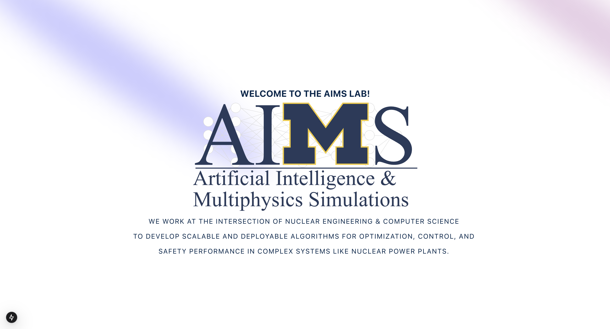

  

<h1 align="center">
  AIMS Official Website
</h1>

  
  
  

# Official AIMS Website
The repository for the official website for the Artificial Intelligence and Multiphysics Simulations (AIMS) Lab. 

## ⭐ Features
- ⚡️ Next.js 15 with App Router
- 🛜 Server and Client Side Rendering
- 🎨 Tailwind CSS - for modern styling
- 🃏 Aceternity UI - accessible UI components
- 🛡 Strict TypeScript and ESLint configuration
- 📱 Fully Responsive
- 🎨 Animation - using Framer Motion

## ✍🏻 Author

- [@jere67](https://github.com/jere67)
- [@nickqchoi](https://github.com/nickqchoi)

## 🪪 License

Please do not deploy this directly to production. It is not a template and is not intended to be used as one.

This project is open source and available under the [MIT License](LICENSE).

## 🛠️ Environment Setup
1. From the project root directory, install Node dependencies:

`npm install`

2. Start the Vite development server:

`npm run dev`

The frontend application will be running at `http://localhost:3000`